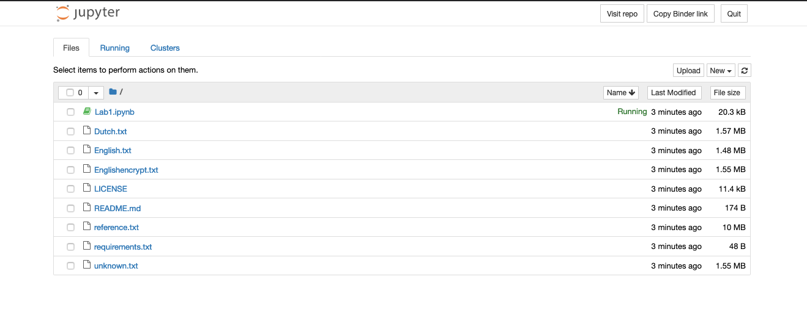
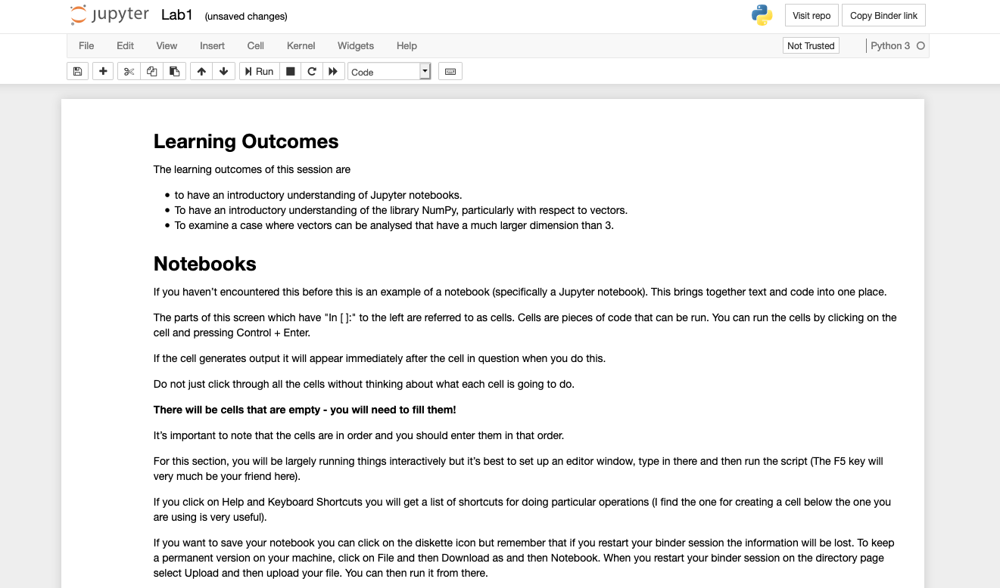

# CS2900 Lab 1

Please click on the launch Binder icon below. 

It might take a few minutes to launch. If after a bit it still doesn't launch then try clickking on the icon again.

When it launches you should get the following

Click on the file "Lab1.ipynb". This should create a new tab with the following. 

Follow the instructions from there...
